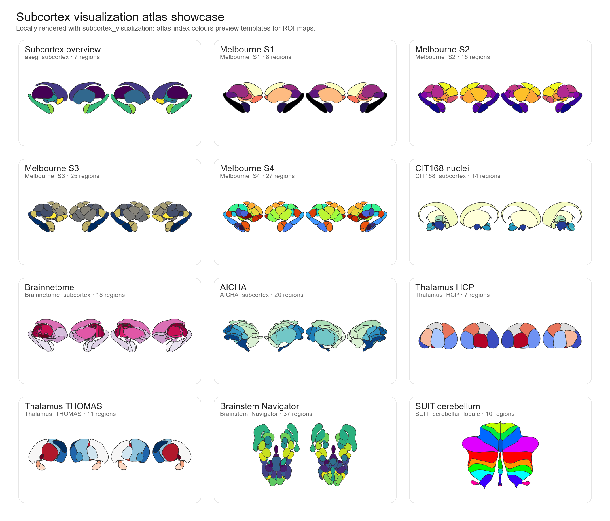

# subcortex-visualization skill

[](#)
[](#)
[](#)
[](https://github.com/mqqq333/subcortex-visualization-skill/actions/workflows/validate.yml)

Codex skill for Annie Bryant's `subcortex_visualization` package.

This repository contains an interactive Codex skill for reproducible two-dimensional visualization of subcortical, thalamic, brainstem, and cerebellar ROI data. It guides an agent through backend choice, environment checks, atlas selection, table validation, NIfTI parcel extraction, figure export, and Methods/caption provenance.

> This repository is an agent skill layer, not a fork or replacement of the original toolbox. It does not vendor the original package, paper PDF, or downloaded source archive.

## What it helps with

- Choose **Python or R** before plotting.
- Check missing dependencies before running code.
- Select a supported subcortical/cerebellar atlas.
- Validate ROI tables against atlas region names.
- Extract ROI summaries from MNI-space NIfTI maps.
- Render editable SVG/PDF figures, with PNG previews when useful.
- Write concise Methods, captions, and provenance notes.
- Plan custom segmentation-to-SVG atlas workflows.

## Example output gallery

The showcase below was reproduced locally with this repository, using the `subcortex_visualization` plotting API and atlas-index colours. It is not copied from the upstream documentation. In real use, the skill maps your ROI values onto the same vector atlas scenes.



Reproduce it locally with:

```bash
python subcortex-visualization/scripts/make_all_atlas_showcase.py --output assets/gallery/all_atlas_showcase.png
```

The skill supports both Python and R workflows: Python is best for NIfTI/MNI-space pipelines, while R is best for tidyverse, patchwork, and ggseg-style composites.

## Try it in 30 seconds

After installing the underlying `subcortex_visualization` package, validate and plot the bundled demo ROI table:

```bash
python subcortex-visualization/scripts/check_subcortex_environment.py --backend python
python subcortex-visualization/scripts/validate_subcortex_table.py \
  --input subcortex-visualization/assets/examples/thalamus_thomas_demo.csv \
  --atlas Thalamus_THOMAS \
  --value-column value
python subcortex-visualization/scripts/plot_subcortex_table.py \
  --input subcortex-visualization/assets/examples/thalamus_thomas_demo.csv \
  --output-prefix demo/thalamus_thomas_demo \
  --atlas Thalamus_THOMAS \
  --value-column value \
  --hemisphere both \
  --formats png,svg
```

The demo writes preview files under `demo/`, which is ignored by git.

## Quick start

Copy the skill folder into your Codex skills directory:

```text
subcortex-visualization/
```

Then ask Codex, for example:

```text
Use the subcortex-visualization skill. I have a ROI table and want to plot a thalamus map.
```

For a first test without real data:

```text
Use the subcortex-visualization skill. Generate simulated thalamus ROI data and make a preview figure.
```

## Interaction pattern

The skill follows a compact figure-design loop:

```text
backend -> environment check -> figure contract -> atlas/region validation -> preview/export -> QC -> revision
```

The first question is usually:

```text
Do you want to use Python or R?
```

Python is better for NIfTI/Python neuroimaging pipelines. R is better for tidyverse, patchwork, and ggseg-style composite figures.

## Environment support

The skill includes a diagnostic helper:

```bash
python subcortex-visualization/scripts/check_subcortex_environment.py --backend both
```

It checks Python packages such as `numpy`, `pandas`, `matplotlib`, `svgpath2mpl`, `nibabel`, `nilearn`, and `subcortex_visualization`, and R availability through `Rscript` plus key R packages. If packages are missing, the skill reports the blocker and asks before installing anything.

## Included bundle

```text
subcortex-visualization/
|-- SKILL.md
|-- agents/
|   `-- openai.yaml
|-- assets/
|   `-- examples/
|       `-- thalamus_thomas_demo.csv
|-- references/
|   |-- atlas_catalog.md
|   |-- environment_setup.md
|   |-- interactive_workflow.md
|   |-- r_usage.md
|   `-- ...
`-- scripts/
    |-- check_subcortex_environment.py
    |-- extract_subcortex_segstats.py
    |-- inspect_subcortex_atlas.py
    |-- make_all_atlas_showcase.py
    |-- plot_subcortex_table.py
    `-- validate_subcortex_table.py
```

## Output philosophy

The skill treats each figure as a visual argument, not a decorative brain icon. It prefers exact atlas names, validated region labels, conservative color scales, editable vector outputs, and explicit provenance.

## Source boundary

This skill was written from public materials for Annie Bryant's `subcortex_visualization` project, including the project documentation, preprint, and source code. Build-only local materials are ignored and are not intended to be pushed to GitHub.

## Star History

[](https://www.star-history.com/#mqqq333/subcortex-visualization-skill&Date)

## Citation

This skill is built around Annie Bryant's `subcortex_visualization` toolbox. If you use the underlying toolbox or its visualizations, please cite the original work:

Bryant, A. G. (2026). *Subcortex visualization: A toolbox for custom data visualization in the subcortex and cerebellum*. bioRxiv. https://www.biorxiv.org/content/10.64898/2026.01.23.699785